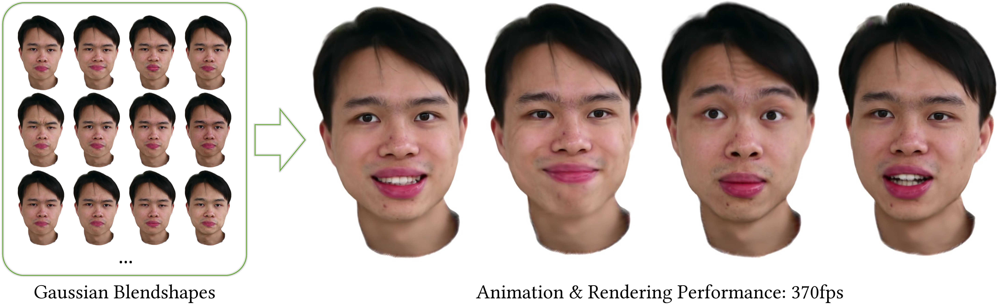

# GaussianBlendshapes
**[Paper](https://gapszju.github.io/GaussianBlendshape/static/pdf/Gaussian_Blendshape.pdf) | [Project Page](https://gapszju.github.io/GaussianBlendshape/)**  



<!--
Our 3D Gaussian blendshapes are analogous to mesh blendshapes in classical parametric face models, which can be linearly blended with expressions coefficients to synthesize photo-realistic avatar animations in real time (370fps). -->

Official PyTorch implementation of the paper "3D Gaussian Blendshapes for Head Avatar Animation".  

## Setup  

This code has been tested on Nvidia RTX 3090 and A800.

Clone the repository:

```
git clone --recursive https://github.com/zjumsj/GaussianBlendshapes.git
```

Create the environment:  

```
conda env create --file environment.yml
conda activate gaussian-blendshapes
```

<!-- PyTorch3D: TODO make it easy to use -->

Install [PyTorch3D](https://github.com/facebookresearch/pytorch3d/blob/main/INSTALL.md) following the official guideline.

Our Gaussian blendshapes are initialized from FLAME model. You need to create an account on the [FLAME website](https://flame.is.tue.mpg.de/download.php) and download FLAME 2020 model. Please unzip FLAME2020.zip and put generic_model.pkl under ./data/FLAME2020. 

## Dataset  

Part of our dataset is from [INSTA](https://github.com/Zielon/INSTA) and [NeRFBlendShape](https://github.com/USTC3DV/NeRFBlendShape-code). The preprocessed dataset can be download [here](https://zjueducn-my.sharepoint.com/:f:/g/personal/3140103086_zju_edu_cn/Egvkvtjac5NJg7_49vmuxysBiWYM-HRINk5un44C3SXdxw).

### Data process

We follow INSTA to process data.
If you'd like to generate your own dataset, please follow the instructions in their [repository](https://github.com/Zielon/INSTA).
You may first use [Metrical Photometric Tracker](https://github.com/Zielon/metrical-tracker) to track and run `generate.sh` provided by INSTA to mask the head.

Copy files from outputs of the tracker and INSTA's script and organize them in the following form:
```
<DATA_ID>
    ├── checkpoint # generated by the tracker 
    ├── images # generated by the script of INSTA
    ├── canonical.obj # generated by the tracker
```

## Running  

### Training

To start training, use  

```shell
# Train on 512x INSTA dataset
python train.py --source_path DATASET_PATH --model_path ./output/face/EXP_NAME
# Train on 512x NeRFBlendShape dataset
python train.py --source_path DATASET_PATH --model_path ./output/face/EXP_NAME --use_nerfBS True --alpha_loss 1 --lpips_loss 0.05
# Train on 1024x HR dataset
python train.py --source_path DATASET_PATH --model_path ./output/face/EXP_NAME --use_HR True
```

### Evaluation  

After training, you can run evaluation with

```shell
# Test on 512x INSTA dataset
python test.py --source_path DATASET_PATH --model_path ./output/face/EXP_NAME
# Test on 512x NeRFBlendShape dataset
python test.py --source_path DATASET_PATH --model_path ./output/face/EXP_NAME --use_nerfBS True
# Test on 1024x HR dataset
python test.py --source_path DATASET_PATH --model_path ./output/face/EXP_NAME --use_HR True 
```

We also provide a C++/CUDA viewer. You can find source code [here](https://github.com/zjumsj/FaceViewer.git)

The results may slightly differ from the metrics reported in the paper, partly due to some bug fixes. 
Additionally, we have observed that running the same experiment multiple times can lead to variations in the results. 
However, the impact of these factors is usually minimal. The deviation is typically in the range of 0-0.2 dB in PSNR, and the visual effect is almost indistinguishable. 

## Credits

This code is partially based on [gaussian-splatting](https://github.com/graphdeco-inria/gaussian-splatting) and [metrical-tracker](https://github.com/Zielon/metrical-tracker). We appreciate the authors for open-sourcing their code.

## Citation  

```
@inproceedings{ma2024gaussianblendshapes,
  author     = {Shengjie Ma and Yanlin Weng and Tianjia Shao and Kun Zhou},
  title      = {3D Gaussian Blendshapes for Head Avatar Animation},
  booktitle  = {ACM SIGGRAPH Conference Proceedings, Denver, CO, United States, July 28 - August 1, 2024},
  year       = {2024},
}
```


